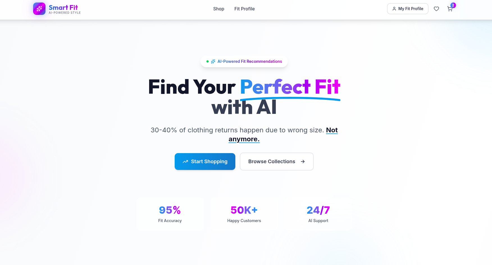
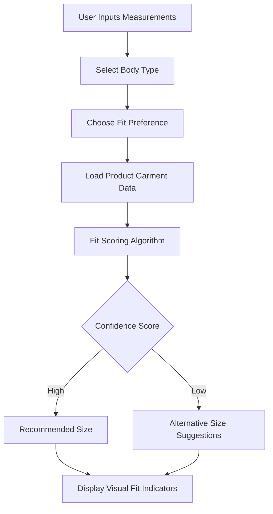

# Smart Fit - AI Fashion Store

## 🎯 Overview

Smart Fit is a premium React e-commerce application that solves the online clothing fit problem using AI-powered size recommendations. Get personalized size suggestions based on your measurements, body type, and fit preferences.





## ✨ Features

### 🤖 AI-Powered Fit Recommendations
- Intelligent size recommendations based on height, weight, body type, and fit preference
- Visual fit indicators (Tight/Perfect/Loose)
- Confidence scores and alternative size suggestions
- Recommendation history tracking

### 🛍️ E-commerce Functionality
- Browse products by category and gender
- Product details with high-quality images
- Shopping cart with quantity management
- Wishlist functionality
- Responsive design for all devices

### 👕 Fit Profile System
- Create and manage your personal fit profile
- Store measurements (height, weight, chest, waist, hips)
- Select body type (Athletic, Mesomorph, Ectomorph, etc.)
- Choose fit preference (Slim, Regular, Relaxed, Oversized)

### 🎨 Premium UI/UX
- Modern glassmorphism effects
- Smooth animations and transitions
- Gradient backgrounds and premium shadows
- Mobile-responsive design
- Dark mode support (coming soon)

## 🚀 Getting Started

### Prerequisites
- Node.js 18+ and npm

### Installation

1. Install dependencies:
```bash
npm install
```

2. Start the development server:
```bash
npm run dev
```

3. Open your browser and navigate to `http://localhost:5173`

## 🏗️ Tech Stack

- **Frontend Framework**: React 18 + TypeScript
- **Build Tool**: Vite
- **Styling**: Tailwind CSS
- **Routing**: React Router DOM
- **State Management**: Zustand
- **Icons**: Lucide React
- **Animations**: Framer Motion (optional enhancement)

## 🧠 AI Integration

The app currently uses a rule-based algorithm for size recommendations. To integrate with a real AI API:

### Option 1: OpenAI

1. Install OpenAI SDK:
```bash
npm install openai
```

2. Add your API key to `.env`:
```
VITE_OPENAI_API_KEY=your_key_here
```

3. Uncomment the AI integration code in `src/services/aiService.ts`

### Option 2: Google Gemini

1. Install Gemini SDK:
```bash
npm install @google/generative-ai
```

2. Add your API key to `.env`:
```
VITE_GEMINI_API_KEY=your_key_here
```

## 📂 Project Structure

```
src/
├── components/
│   ├── ui/              # Reusable UI components
│   ├── layout/          # Header, Footer
│   ├── product/         # Product-related components
│   └── fit/             # Fit recommendation components
├── pages/               # Page components
├── store/               # Zustand stores
├── services/            # API services
├── data/                # Mock data
├── lib/                 # Utility functions
└── types/               # TypeScript types
```

## 🎨 Customization

### Colors
Edit `tailwind.config.js` to customize the color scheme.

### Products
Add or modify products in `src/data/mockProducts.ts`.

### AI Logic
Customize the size recommendation algorithm in `src/services/aiService.ts`.

## 🚢 Deployment

### Build for Production

```bash
npm run build
```

The built files will be in the `dist/` directory.

### Deploy to Vercel/Netlify

1. Push your code to GitHub
2. Connect your repository to Vercel or Netlify
3. Configure build settings:
   - Build command: `npm run build`
   - Output directory: `dist`

## 📝 License

MIT License - feel free to use this project for personal or commercial purposes.

## 🤝 Contributing

Contributions are welcome! Feel free to open issues or submit pull requests.

## 📧 Contact

For questions or support, please open an issue on GitHub.

---

Built with ❤️ using React + Vite + Tailwind CSS
